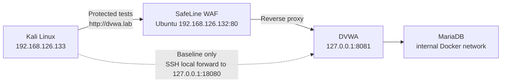

# SafeLine WAF Protection Lab

A documented two-VM security lab that places **SafeLine WAF** in front of **DVWA**, proves four vulnerabilities at an isolated origin, and compares the same traffic through the protected route.

> **Result:** SQL injection, reflected XSS, and local file inclusion were blocked in the sampled tests. Command injection initially reached DVWA; the evidence later shows **Strict** command-injection policy and blocked requests. Both successful and unsuccessful protection outcomes are documented.

[Read the assessment](reports/ASSESSMENT.md) · [Download the PDF report](reports/SafeLine-DVWA-Assessment.pdf) · [View structured results](reports/results.csv) · [Review evidence](evidence/README.md) · [Understand the commands](docs/09-command-reference.md)

## Why this project matters

This project demonstrates more than installing a WAF. It shows how to design a controlled comparison, isolate a deliberately vulnerable backend, correlate client behavior with security telemetry, identify an audit-only policy gap, and verify a targeted remediation.

**Skills demonstrated:** network segmentation, reverse-proxy architecture, Docker Compose, Linux administration, HTTP traffic analysis, Burp Suite, WAF policy tuning, evidence handling, and technical reporting.

## Architecture



DVWA listens only on Ubuntu loopback. Kali cannot reach port 8081 directly. The temporary SSH tunnel creates a controlled baseline route; normal lab traffic enters through SafeLine at `dvwa.lab`.

## Validated results

| Test | Origin behavior | SafeLine result | Final assessment |
|---|---|---|---|
| SQL injection | Returned multiple user records | Blocked and logged | Prevented |
| Reflected XSS | Executed `alert(1)` | Blocked and logged | Prevented |
| Command injection, initial tests | Returned `www-data` | Audited and allowed | Policy gap |
| Command injection, Strict setting | Returned `www-data` | Blocked and logged | Prevented after tuning |
| Local file inclusion | Displayed `/etc/passwd` records | Blocked and logged | Prevented |

The command-injection sequence shows allowed requests, a recorded upgrade, a Strict policy setting, and subsequent blocked requests. This supports policy tuning as the working remediation. The version discrepancy and missing request-level policy snapshots prevent attributing the change solely to the upgrade or to a single configuration change.

Screenshot `20` reports management-container version `9.4.2`; later dashboard captures still show `9.1.0-lts`. The available evidence does not establish why they differ or independently link every test to the upgraded instance. Exact test-version attribution remains unverified.

## Selected evidence

| Origin proof | Protected proof | WAF telemetry |
|---|---|---|
| [SQLi returned records](evidence/12-sqli-origin-success.png) | [Access Forbidden](evidence/13-sqli-waf-block.png) | [SQL Inj / Blocked](evidence/14-sqli-safeline-event.png) |
| [XSS executed](evidence/15-xss-origin-alert.png) | [Access Forbidden](evidence/16-xss-waf-block.png) | [XSS / Blocked](evidence/17-xss-safeline-log.png) |
| [Command executed](evidence/18-command-origin-success.png) | [Blocked after Strict](evidence/23-command-waf-block-strict.png) | [Audit-to-block sequence](evidence/24-command-safeline-log.png) |
| [File included](evidence/25-file-inclusion-origin-success.png) | [Access Forbidden](evidence/26-file-inclusion-waf-block.png) | [File Include / Blocked](evidence/27-file-inclusion-safeline-log.png) |

All 28 screenshots were reviewed before inclusion. [The evidence review](evidence/EVIDENCE-REVIEW.md) separates core, supporting, and optional captures and lists useful additions for a future iteration.

## Reproduce the lab

Run these commands inside the isolated Ubuntu VM after Docker is installed:

```bash
bash scripts/init-env.sh
sudo bash scripts/preflight.sh
sudo docker compose config --quiet
sudo docker compose pull
sudo docker compose up -d --wait --wait-timeout 180
```

Why these steps matter:

- `init-env.sh` creates unique database credentials locally and keeps them out of Git.
- `preflight.sh` checks architecture, memory, storage, Docker version, and port conflicts without changing the host.
- `docker compose config --quiet` validates the configuration without printing expanded secrets.
- `docker compose up --wait` does not report success until the database health check passes.
- The Compose mapping `127.0.0.1:8081:80` prevents direct access to DVWA from Kali.
- The database uses an internal Docker network and has no host port.

Continue with the [Ubuntu build guide](docs/02-ubuntu-setup.md), [Kali and SafeLine setup](docs/03-kali-and-safeline.md), and [test procedure](docs/04-testing.md). The [command reference](docs/09-command-reference.md) explains the important commands and the decision each one supports.

## Repository map

```text
.
├── compose.yaml                 # Loopback-bound DVWA and internal MariaDB
├── scripts/                     # Credential, preflight, evidence, and integrity helpers
├── docs/                        # Build, test, troubleshooting, and command rationale
├── evidence/                    # 28 reviewed screenshots and SHA-256 manifest
├── reports/ASSESSMENT.md        # Completed technical assessment
├── reports/results.csv          # Machine-readable observations
└── .github/workflows/validate.yml
```

## Validation status

The portfolio checks verify file links, result records, screenshot checksums, script syntax, and Compose configuration. They do not rerun the attack tests. The supplied setup is a reconstruction of the documented topology with credential-generation and validation helpers added for reuse; those helpers were not part of the photographed tests. Mutable image tags remain a reproducibility limitation until the lab image digests are recorded.

## Scope and limitations

This is a controlled lab validation, not an exhaustive penetration test. It uses one representative payload per vulnerability class. Authentication hardening, HTTPS termination, denial of service, persistence, container escape, and post-exploitation were outside scope. DVWA is intentionally vulnerable and must remain on private VMware networks.

## Interview talking points

- Why I separated the baseline and protected routes instead of toggling the WAF on one path.
- How loopback binding and a host-only network reduced accidental exposure.
- Why a WAF log alone is insufficient proof of prevention.
- How I distinguished observed policy behavior from an unproven version-related cause.
- Why application fixes remain necessary even when a WAF blocks the test payload.

## Documentation

1. [Architecture and threat model](docs/01-architecture.md)
2. [Ubuntu and DVWA build](docs/02-ubuntu-setup.md)
3. [Kali and SafeLine setup](docs/03-kali-and-safeline.md)
4. [Test procedure](docs/04-testing.md)
5. [Evidence workflow](docs/05-evidence.md)
6. [GitHub publication](docs/06-github.md)
7. [Troubleshooting and cleanup](docs/07-troubleshooting.md)
8. [Sources](docs/08-sources.md)
9. [Command rationale](docs/09-command-reference.md)

## Responsible use

Use this project only on systems you own or are explicitly authorized to test. Never expose DVWA or the SafeLine management console to the public internet.
