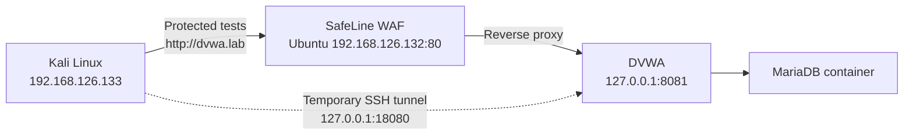

# SafeLine WAF + DVWA Homelab Assessment

**Test window:** 30 September–1 October 2026  
**Report date:** 1 October 2026  
**Environment:** Isolated VMware Fusion lab  
**Target:** DVWA at Low security  
**Recorded tools:** SafeLine UI 9.1.0-lts and management CLI 9.4.2 (see limitations); Kali Linux ARM64; Burp Suite Community 2026.8

## Executive summary

The lab confirmed exploitable SQL injection, reflected cross-site scripting (XSS), operating-system command injection, and local file inclusion at the deliberately vulnerable DVWA origin. SafeLine blocked SQL injection, reflected XSS, and file inclusion through the protected route and recorded matching attack events.

The command-injection sequence shows allowed requests, a recorded upgrade, a Strict policy setting, and subsequent blocked requests. This supports policy tuning as the working remediation. The version discrepancy and missing request-level policy snapshots prevent attributing the change solely to the upgrade or to a single configuration change.

## Architecture and isolation

DVWA was published only on Ubuntu loopback. A direct connection from Kali to Ubuntu port 8081 was refused, confirming that the origin was not reachable on the host-only network. Controlled baseline testing used an SSH local-forward to Kali loopback. Protected tests used `dvwa.lab`, which resolved to SafeLine on Ubuntu.

Evidence: [DVWA binding and health](../evidence/04-dvwa-running.png), [origin isolation](../evidence/05-origin-isolation.png), [SafeLine containers](../evidence/06-safeline-running.png), [application configuration](../evidence/08-safeline-application-config.png), and [baseline tunnel](../evidence/11-origin-tunnel.png).

## Environment

| Component | Observed configuration |
|---|---|
| Ubuntu server | Ubuntu 24.04.5 LTS, ARM64, approximately 6 GiB RAM |
| Kali tester | Kali Rolling 2026.2, ARM64; approximately 2 GiB visible in the initial environment capture |
| Host-only network | Ubuntu `192.168.126.132`; Kali `192.168.126.133` |
| NAT connectivity | Ubuntu `172.16.105.133`; Kali `172.16.105.135` during final setup |
| Container runtime | Docker with Compose v5.5.1 |
| Origin application | `ghcr.io/digininja/dvwa:latest` with `mariadb:10`, bound to `127.0.0.1:8081` |
| WAF | UI shows 9.1.0-lts; separate management CLI reports 9.4.2 |
| Protected application | `dvwa.lab` on port 80, Defense mode |
| Interception tool | Burp Suite Community 2026.8 |

The earliest environment screenshots show `172.20.10.0/28` addresses from an earlier network stage. The final dual-adapter configuration used the host-only and NAT addresses shown above.

## Method

1. Set DVWA security to Low and verify each behavior through the temporary origin tunnel.
2. Repeat the same proof through `http://dvwa.lab`, which routes through SafeLine.
3. Treat an Access Forbidden page as prevention evidence only when a corresponding SafeLine event identified the attack category and action.
4. Compare path, payload, source IP, and displayed time. Retain block-page request IDs separately; no event-detail capture proves an exact ID join.
5. Capture a cookie-free `GET /` request in Burp. The screenshot proves interception; it does not prove the subsequent forwarding or dropping action.

The payloads were limited to the isolated DVWA lab. No persistence, destructive action, credential collection, or external target was tested.

## Results

| Test | Origin result | Protected result | SafeLine action | Outcome |
|---|---|---|---|---|
| SQL injection | Multiple user records returned | Access Forbidden | `SQL Inj` — Blocked | Prevented |
| Reflected XSS | Browser executed `alert(1)` | Access Forbidden | `XSS` — Blocked | Prevented |
| Command injection, initial tests | `whoami` returned `www-data` | Same command output returned | `Cmd Inj` — Audited | Detected, allowed |
| Command injection, after recorded upgrade | `whoami` returned `www-data` | Same command output returned | `Cmd Inj` — Audited | Detected, allowed |
| Command injection, Strict setting | `whoami` returned `www-data` | Access Forbidden | `Cmd Inj` — Blocked | Prevented after tuning |
| Local file inclusion | `/etc/passwd` records displayed | Access Forbidden | `File Include` — Blocked | Prevented |

The complete machine-readable record is in [results.csv](results.csv).

## Findings

### 1. Protected route blocked SQL injection

The origin accepted a basic tautology and returned multiple DVWA user records. Through SafeLine, the same request received Access Forbidden. The matching event classified it as `SQL Inj`, action `Blocked`, from `192.168.126.133` at `10:24:39`.

Evidence: [origin success](../evidence/12-sqli-origin-success.png), [WAF block](../evidence/13-sqli-waf-block.png), and [SafeLine event](../evidence/14-sqli-safeline-event.png).

### 2. Protected route blocked reflected XSS

The origin reflected the script and Firefox displayed the expected alert. The protected request received Access Forbidden, and SafeLine logged category `XSS` with action `Blocked` at `10:37:36`.

Evidence: [origin alert](../evidence/15-xss-origin-alert.png), [WAF block](../evidence/16-xss-waf-block.png), and [SafeLine log](../evidence/17-xss-safeline-log.png).

### 3. Command injection required explicit policy tuning

The origin executed `whoami` and returned `www-data`. Initial protected-route captures also show `www-data`, while the log lists related command-injection traffic as `Audited`. A later protected-route capture, placed after the upgrade record in the evidence sequence, still shows command execution. Exact WAF version and active policy for each request were not captured.

The subsequent policy screenshot shows `CMD Inj` set to Strict. The block-page screenshot is taken around 11:22, and the log contains blocked `Cmd Inj` rows at 11:22:07 and 11:24:23, with audited rows in between. The 11:22:07 row is the closest supporting event for that block page; without event details it is not a verified request-ID match. The mixed sequence supports recording both audit and block behavior rather than assuming uninterrupted enforcement.

Evidence: [origin success](../evidence/18-command-origin-success.png), [allowed before tuning](../evidence/19-command-waf-bypass-before-fix.png), [upgrade to 9.4.2](../evidence/20-safeline-upgraded-9.4.2.png), [allowed after upgrade](../evidence/21-command-waf-bypass-after-upgrade.png), [Strict policy](../evidence/22-semantic-analysis-set-to-strict.png), [WAF block](../evidence/23-command-waf-block-strict.png), and [SafeLine log](../evidence/24-command-safeline-log.png).

**Operational recommendation:** retain `CMD Inj` in Strict for this application, monitor false positives, and use a staged audit-to-block process for future policy changes. Remediate the application itself by validating the IP address and invoking the ping process without a shell.

### 4. Protected route blocked local file inclusion

The origin included `/etc/passwd` and displayed container account records. The protected request received Access Forbidden, and SafeLine logged category `File Include`, action `Blocked`, at `11:41:38`.

Evidence: [origin success](../evidence/25-file-inclusion-origin-success.png), [WAF block](../evidence/26-file-inclusion-waf-block.png), and [SafeLine log](../evidence/27-file-inclusion-safeline-log.png).

### 5. Burp interception path was validated

Burp Suite Community intercepted a cookie-free request to `http://dvwa.lab/`. The request line, host, resolved target, and zero-cookie inspector state are visible. This demonstrates that future manual test traffic can be captured without exposing an authenticated DVWA session in the evidence.

Evidence: [Burp interception](../evidence/28-burp-intercept-dvwa.png).

## Remediation priorities

1. Fix the application vulnerabilities. Use parameterized queries, context-aware output encoding, strict allowlists, non-shell process execution, and fixed server-side file mappings.
2. Keep the DVWA origin bound to loopback and preserve the host-only network boundary.
3. Keep SafeLine current and review semantic-analysis actions after upgrades; software version alone does not guarantee the desired block behavior.
4. Retain command injection in Strict for this application and monitor logs for false positives.
5. Protect the SafeLine management interface with administrative network restrictions and strong authentication.
6. Repeat the test matrix after any DVWA, SafeLine, application, or policy change.

## Limitations

- Each vulnerability class used one representative payload; the work is a control validation, not exhaustive bypass testing.
- DVWA is intentionally vulnerable and does not represent a production application's full behavior.
- Authentication controls, HTTPS termination, denial of service, persistence, container escape, and post-exploitation were outside scope.
- Screenshot `20` reports management-container version `9.4.2`; later dashboard captures still show `9.1.0-lts`. The available evidence does not establish why they differ or independently link every test to the upgraded instance. Exact test-version attribution remains unverified.
- List views do not link block-page IDs to event IDs. Exact request-level correlation and policy attribution remain incomplete.
- The initial Balance settings were not recorded alongside each test; the report does not claim that a particular default profile guarantees these results.
- No benign-traffic regression set, latency benchmark, or pinned image-digest record was captured.
- Times are reported as displayed and were not proven to share one timezone across every component.

## Conclusion

The evidence establishes an isolated vulnerable origin, four demonstrated vulnerability classes, and WAF blocks for the sampled requests. The command-injection sequence adds a useful operational lesson: detection, blocking, software version, and policy state must be verified separately. Strict policy is the documented remediation setting; stronger causal attribution requires a synchronized retest with request-level event details.

